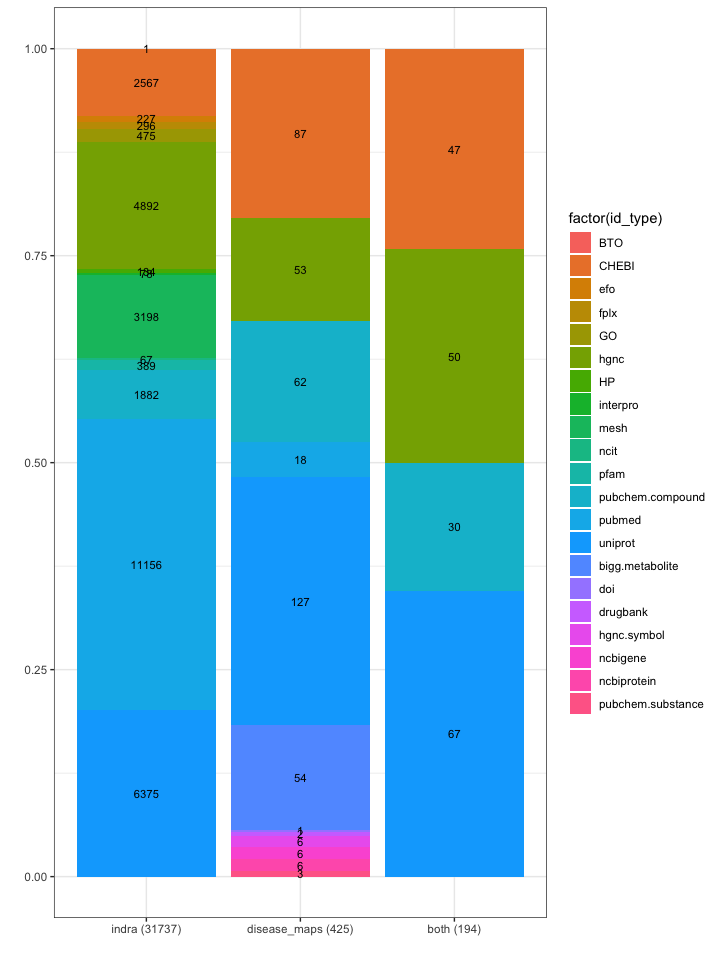

COVID19 Disease Map Identifier Analysis
================
Augustin Luna
14 May, 2020

  - [PURPOSE](#purpose)
  - [LOAD LIBRARIES](#load-libraries)
  - [DISEASE MAPS](#disease-maps)
      - [Download COVID19 Disease Maps](#download-covid19-disease-maps)
      - [Read COVID19 Disease Maps
        Tables](#read-covid19-disease-maps-tables)
      - [Normalize IDs](#normalize-ids)
          - [Replace Characters](#replace-characters)
          - [Replace URNs With
            identifiers.org](#replace-urns-with-identifiers.org)
          - [Fix identifiers.org Old
            Format](#fix-identifiers.org-old-format)
          - [Simplify “file” Text](#simplify-file-text)
      - [Export Data](#export-data)
  - [INDRA: TEXT-MINING DATASET](#indra-text-mining-dataset)
      - [Read Text-Mining Data](#read-text-mining-data)
      - [Normalize IDs](#normalize-ids-1)
          - [Fix identifiers.org Old Format And Add identifiers.org To
            PubMed](#fix-identifiers.org-old-format-and-add-identifiers.org-to-pubmed)
          - [Match Identifier Delimiters To Match Disease
            Maps](#match-identifier-delimiters-to-match-disease-maps)
      - [Export Data](#export-data-1)
      - [Identifiers With Issues](#identifiers-with-issues)
          - [Formatting Questions](#formatting-questions)
          - [Missing Article Identifier](#missing-article-identifier)
          - [IDs Not Available On
            identifiers.org](#ids-not-available-on-identifiers.org)
          - [Miscellaneous](#miscellaneous)
  - [DATASET IDENTIFIER COMPARISON](#dataset-identifier-comparison)
      - [Set Comparisons](#set-comparisons)
      - [Read Data](#read-data)
      - [Count identifiers.org IDs Used And Extract
        Namespace](#count-identifiers.org-ids-used-and-extract-namespace)
      - [Merge Data](#merge-data)
      - [Plot Data](#plot-data)
          - [Identifier Counts By Namespace (Disease Maps, Indra,
            Intersected
            (Both))](#identifier-counts-by-namespace-disease-maps-indra-intersected-both)
          - [Venn Diagram](#venn-diagram)
  - [FREQUENCY COMPARISON: COUNTS OF INTERACTIONS WITH GIVEN IDS (TOP
    10)](#frequency-comparison-counts-of-interactions-with-given-ids-top-10)
      - [Merge Data From The Two
        Sources](#merge-data-from-the-two-sources)
      - [Uniprot](#uniprot)
      - [ChEBI](#chebi)
      - [HGNC](#hgnc)
      - [PubMed](#pubmed)
          - [Potential Issues](#potential-issues)
          - [Publication Counts By
            Dataset](#publication-counts-by-dataset)

# PURPOSE

  - Standardize identifiers for COVID19 pathways from 1) Disease Maps
    (human curation) and 2) Indra (text mining).
  - Compare identifiers used by the two efforts
  - List identifiers commonly used by Disease Maps curated that are
    represented in the Indra dataset

# LOAD LIBRARIES

``` r
library(readr)
library(stringr)
library(magrittr)
library(ggplot2)
library(knitr)
```

# DISEASE MAPS

## Download COVID19 Disease Maps

``` bash
wget --no-clobber https://cannin.github.io/covid19-sbgn/
```

## Read COVID19 Disease Maps Tables

``` r
files <- dir("cannin.github.io/covid19-sbgn/", full.names=TRUE)
filesTmp <- dir("cannin.github.io/covid19-sbgn/")

dm <- read_tsv(files[1], col_types = cols(
  PARTICIPANT_A = col_character(),
  INTERACTION_TYPE = col_character(),
  PARTICIPANT_B = col_character(),
  ANNOTATION_SOURCE = col_logical(),
  ANNOTATION_INTERACTION = col_character(),
  ANNOTATION_TARGET = col_logical(),
  SOURCE_CLASS = col_character(),
  TARGET_CLASS = col_character()
))
dm$file <- files[1]

for(i in 2:length(files)) {
  #i <- 1
  file <- files[i]
  tmpDat <- read_tsv(file, col_types = cols(
    PARTICIPANT_A = col_character(),
    INTERACTION_TYPE = col_character(),
    PARTICIPANT_B = col_character(),
    ANNOTATION_SOURCE = col_character(),
    ANNOTATION_INTERACTION = col_character(),
    ANNOTATION_TARGET = col_character(),
    SOURCE_CLASS = col_character(),
    TARGET_CLASS = col_character()
  ))
  tmpDat$file <- files[i]
  dm <- rbind(dm, tmpDat)
}
```

## Normalize IDs

### Replace Characters

``` r
#dm$ANNOTATION_SOURCE <- tolower(dm$ANNOTATION_SOURCE)
#dm$ANNOTATION_TARGET <- tolower(dm$ANNOTATION_TARGET)
#dm$ANNOTATION_INTERACTION <- tolower(dm$ANNOTATION_INTERACTION)

# NOTE: This is caused as sbgn2sif to support the Graphviz DOT format
dm$ANNOTATION_SOURCE <- str_replace_all(dm$ANNOTATION_SOURCE, "_", ":") 
dm$ANNOTATION_TARGET <- str_replace_all(dm$ANNOTATION_TARGET, "_", ":") 
dm$ANNOTATION_INTERACTION <- str_replace_all(dm$ANNOTATION_INTERACTION, "_", ":") 

dm$ANNOTATION_SOURCE <- str_replace_all(dm$ANNOTATION_SOURCE, "http:", "https:") 
dm$ANNOTATION_TARGET <- str_replace_all(dm$ANNOTATION_SOURCE, "http:", "https:") 
dm$ANNOTATION_INTERACTION <- str_replace_all(dm$ANNOTATION_SOURCE, "http:", "https:") 

dm$ANNOTATION_SOURCE <- str_replace_all(dm$ANNOTATION_SOURCE, "%3A", ":") 
dm$ANNOTATION_TARGET <- str_replace_all(dm$ANNOTATION_SOURCE, "%3A", ":") 
dm$ANNOTATION_INTERACTION <- str_replace_all(dm$ANNOTATION_SOURCE, "%3A", ":") 

dm$ANNOTATION_SOURCE <- str_replace_all(dm$ANNOTATION_SOURCE, "%2F", "/") 
dm$ANNOTATION_TARGET <- str_replace_all(dm$ANNOTATION_SOURCE, "%2F", "/") 
dm$ANNOTATION_INTERACTION <- str_replace_all(dm$ANNOTATION_SOURCE, "%2F", "/")
```

### Replace URNs With identifiers.org

``` r
mapping <- read_delim("id_mapping_sm.txt", " ", col_types = cols(
  full_name = col_character(),
  identifiers_org_base = col_character(),
  urn_base = col_character()
))

for(i in 1:nrow(mapping)) {
  dm$ANNOTATION_SOURCE <- str_replace_all(dm$ANNOTATION_SOURCE, mapping$urn_base[i], mapping$identifiers_org_base[i])    
  dm$ANNOTATION_TARGET <- str_replace_all(dm$ANNOTATION_TARGET, mapping$urn_base[i], mapping$identifiers_org_base[i])    
  dm$ANNOTATION_INTERACTION <- str_replace_all(dm$ANNOTATION_INTERACTION, mapping$urn_base[i], mapping$identifiers_org_base[i])    
}  
```

### Fix identifiers.org Old Format

``` r
dm$ANNOTATION_SOURCE <- str_replace_all(dm$ANNOTATION_SOURCE, "https://identifiers.org/chebi:CHEBI:", "https://identifiers.org/CHEBI:") 
dm$ANNOTATION_TARGET <- str_replace_all(dm$ANNOTATION_SOURCE, "https://identifiers.org/chebi:CHEBI:", "https://identifiers.org/CHEBI:")
dm$ANNOTATION_INTERACTION <- str_replace_all(dm$ANNOTATION_SOURCE, "https://identifiers.org/chebi:CHEBI:", "https://identifiers.org/CHEBI:")
```

### Simplify “file” Text

``` r
dm$file <- str_remove(dm$file, "cannin.github.io/covid19-sbgn//")
dm$file <- str_remove(dm$file, "_simplified.sif")
```

## Export Data

``` r
write_tsv(dm, "dm_cleaned.txt", na = "")

dm_ids <- c(dm$ANNOTATION_SOURCE, dm$ANNOTATION_TARGET, dm$ANNOTATION_INTERACTION)
dm_ids_x <- sapply(dm_ids, function(x) { 
  tmp <- strsplit(x, "\\|") 
  tmp[[1]]
}, USE.NAMES = FALSE) %>% unlist %>% sort

dm_ids_full <- dm_ids_x
write_lines(dm_ids_x, "dm_ids_full.txt")

dm_ids_x <- dm_ids_x %>% unique %>% sort
write_lines(dm_ids_x, "dm_ids.txt")
```

# INDRA: TEXT-MINING DATASET

Python code for conversion of Indra statements to TSV

``` python
import json
from indra.sources import reach, trips
from indra.statements.statements import stmts_to_json, stmts_from_json, stmts_from_json_file
from indra.assemblers.tsv.assembler import TsvAssembler

ta = TsvAssembler()

stmts_json = stmts_from_json_file('statements_2020-04-21-17-41-46.json')

ta.add_statements(stmts_json)
model_tsv = ta.make_model("statements_2020-04-21-17-41-46.tsv", add_curation_cols=True)
```

## Read Text-Mining Data

``` r
indra <- read_tsv("statements_2020-04-21-17-41-46.tsv", col_types=cols(
  .default = col_logical(),
  INDEX = col_double(),
  UUID = col_character(),
  TYPE = col_character(),
  STR = col_character(),
  AG_A_TEXT = col_character(),
  AG_A_LINKS = col_character(),
  AG_A_STR = col_character(),
  AG_B_TEXT = col_character(),
  AG_B_LINKS = col_character(),
  AG_B_STR = col_character(),
  PMID = col_character(),
  TEXT = col_character()
))
```

## Normalize IDs

### Fix identifiers.org Old Format And Add identifiers.org To PubMed

``` r
indra_mapping <- read_delim("id_mapping_indra.txt", " ", col_types = cols(
  full_name = col_character(),
  indra_base = col_character(),
  modification_base = col_character()
))

max_iter <- nrow(indra_mapping)
pb <- txtProgressBar(min=1, max=max_iter, style=3)

for(i in 1:nrow(indra_mapping)) {
  #setTxtProgressBar(pb, i)
  
  indra$AG_A_LINKS <- str_replace_all(indra$AG_A_LINKS, indra_mapping$indra_base[i], indra_mapping$modification_base[i])    
  indra$AG_B_LINKS <- str_replace_all(indra$AG_B_LINKS, indra_mapping$indra_base[i], indra_mapping$modification_base[i])    
}

indra$PMID <- paste0("https://identifiers.org/pubmed:", indra$PMID)
```

### Match Identifier Delimiters To Match Disease Maps

``` r
indra$AG_A_LINKS <- str_replace_all(indra$AG_A_LINKS, ", ", "|")
indra$AG_B_LINKS <- str_replace_all(indra$AG_B_LINKS, ", ", "|")
indra$PMID <- str_replace_all(indra$PMID, ", ", "|")
```

## Export Data

``` r
write_tsv(indra, "indra_cleaned.txt", na = "")

indra_ids <- c(indra$AG_A_LINKS , indra$AG_B_LINKS, indra$PMID)
indra_ids_x <- sapply(indra_ids, function(x) { 
  tmp <- strsplit(x, "\\|") 
  tmp[[1]]
}, USE.NAMES = FALSE) %>% unlist %>% sort

indra_ids_full <- indra_ids_x
write_lines(indra_ids_x, "indra_ids_full.txt")

indra_ids_x <- indra_ids_x %>% unique %>% sort
write_lines(indra_ids_x, "indra_ids.txt")
```

## Identifiers With Issues

### Formatting Questions

Example:

  - <https://identifiers.org/uniprot/B3EWF7>, O95278

Is identifiers.org missing? Or is this the format for multiple
identifiers in the same namespace? Every ID with the proper namespace
would avoid additional code.

``` 
37028   99bb7bfd-3a40-4545-b016-d0b08061384b    Activation  Activation(Polymorphism, Single Nucleotide(), EPM2A())  SNPs    https://identifiers.org/mesh/D020641    Polymorphism, Single Nucleotide()   LD  https://identifiers.org/hgnc/HGNC:3413, https://identifiers.org/uniprot/B3EWF7, O95278  EPM2A() 25534905    This reduction in SNPs decreased the level of LD 177 between SNPs and reduced the squared correlation between SNPs to r 2 < 0.75 .                                                  
71988   d9d57816-e222-4a8e-ab8e-2573c73df5ad    Inhibition  Inhibition(autophagy(), EPM2A())    autophagy   https://identifiers.org/go/GO:0006914, https://identifiers.org/mesh/D001343 autophagy() LDs https://identifiers.org/hgnc/HGNC:3413, https://identifiers.org/uniprot/B3EWF7, O95278  EPM2A() 30544615    In addition to acting as a pro-viral factor benefiting viral growth , autophagy has also been shown to eliminate LDs and mitochondria ( Table 1 ) [ 429 , 430 ] .       

65231   b4d18e37-1357-4395-a61d-fbe05462ebe4    Inhibition  Inhibition(quercetin(), activity()) Apigenin, luteolin, and quercetin   https://identifiers.org/chebi/16243, https://identifiers.org/pubchem.compound/5280343   quercetin() activity        activity()  20934345    Apigenin, luteolin, and quercetin inhibited 3CL(pro) activity with IC(50) values of 280.8, 20.2, and 23.8μM, respectively.                                                  
65851   a2214f57-31e1-4155-a8d2-b2dd33a75992    Inhibition  Inhibition(quercetin(), Dengue-2 NS2B-NS3pro()) Quercetin   https://identifiers.org/chebi/CHEBI:16243, https://identifiers.org/pubchem.compound/5280343 quercetin() Dengue-2 NS2B-NS3pro        Dengue-2 NS2B-NS3pro()  28700665    Indeed, previously Myricetin and Quercetin have been characterized to allosterically inhibit Dengue-2 NS2B-NS3pro with Ki values of 4.7 and 20.7 muM respectively, which, however, are much weaker than those for Zika NS2B-NS3pro here.        False   
```

### Missing Article Identifier

    69  f452c957-737e-4fc7-be5c-448e120e14ab    Acetylation Acetylation(Mass Spectrometry(), Mucins())  mass spectrometry   https://identifiers.org/mesh/D013058    Mass Spectrometry() mucin   https://identifiers.org/mesh/D009077    Mucins()        In the current study, we investigated the NanS- and NanS-p-mediated digestion of synthetic O acetylated neuraminic acids and bovine submaxillary glands mucin (BSM)-derived O-acetylneuraminic acids by high-performance thin-layer chromatography (HPTLC) and nano electrospray ionization mass spectrometry (nanoESI MS).     True

### IDs Not Available On identifiers.org

How can these be added to identifiers.org?

    UPPRO:PRO_0000449629
    PR:000000019
    https://www.nextprot.org/term/FA-04255
    DOID:DOID:0050743

### Miscellaneous

TODO: These need further debugging

    "https://identifiers.org/pubmed:NA"
    "https://identifiers.org/uniprot:"

# DATASET IDENTIFIER COMPARISON

## Set Comparisons

``` r
t1 <- intersect(dm_ids_x, indra_ids_x) %>% sort
t2 <- setdiff(dm_ids_x, indra_ids_x) %>% sort
t3 <- setdiff(indra_ids_x, dm_ids_x) %>% sort
t4 <- union(dm_ids_x, indra_ids_x) %>% sort

length(t1)
```

    ## [1] 194

``` r
length(t2)
```

    ## [1] 231

``` r
length(t3)
```

    ## [1] 31705

``` r
length(t4)
```

    ## [1] 32130

``` r
write_lines(t1, "intersect.txt")
write_lines(t2, "setdiff_1.txt")
write_lines(t3, "setdiff_2.txt")
write_lines(t4, "union.txt")
```

## Read Data

``` r
indra_ids <- read_lines("indra_ids.txt")
dm_ids <- read_lines("dm_ids.txt")

indra_ids_full <- read_lines("indra_ids_full.txt")
dm_ids_full <- read_lines("dm_ids_full.txt")

indra_cleaned <- read_tsv("indra_cleaned.txt", col_types = cols(
  .default = col_logical(),
  INDEX = col_double(),
  UUID = col_character(),
  TYPE = col_character(),
  STR = col_character(),
  AG_A_TEXT = col_character(),
  AG_A_LINKS = col_character(),
  AG_A_STR = col_character(),
  AG_B_TEXT = col_character(),
  AG_B_LINKS = col_character(),
  AG_B_STR = col_character(),
  PMID = col_character(),
  TEXT = col_character()
))

dm_cleaned <- read_tsv("dm_cleaned.txt", col_types = cols(
  PARTICIPANT_A = col_character(),
  INTERACTION_TYPE = col_character(),
  PARTICIPANT_B = col_character(),
  ANNOTATION_SOURCE = col_character(),
  ANNOTATION_INTERACTION = col_character(),
  ANNOTATION_TARGET = col_character(),
  SOURCE_CLASS = col_character(),
  TARGET_CLASS = col_character(),
  file = col_character()
))
```

## Count identifiers.org IDs Used And Extract Namespace

``` r
idx <- grepl("https://identifiers.org/", indra_ids)
indra_ids <- indra_ids[idx]
indra_ids_sm <- str_remove(indra_ids, "https://identifiers.org/")
indra_ids_sm <- sapply(indra_ids_sm, function(x) {
  strsplit(x, ":")[[1]][1]
}, USE.NAMES = FALSE)
length(indra_ids)
```

    ## [1] 31737

``` r
idx <- grepl("https://identifiers.org/", dm_ids)
dm_ids <- dm_ids[idx]
dm_ids_sm <- str_remove(dm_ids, "https://identifiers.org/")
dm_ids_sm <- sapply(dm_ids_sm, function(x) {
  strsplit(x, ":")[[1]][1]
}, USE.NAMES = FALSE)
length(dm_ids)
```

    ## [1] 425

``` r
both <- intersect(dm_ids, indra_ids)
both_sm <- str_remove(both, "https://identifiers.org/")
both_sm <- sapply(both_sm, function(x) {
  strsplit(x, ":")[[1]][1]
}, USE.NAMES = FALSE)
length(both)
```

    ## [1] 194

## Merge Data

``` r
t1 <- data.frame(id_type=indra_ids_sm, db="indra", id=indra_ids)
t2 <- data.frame(id_type=dm_ids_sm, db="disease_maps", id=dm_ids)
t3 <- data.frame(id_type=both_sm, db="both", id=both)
dat <- rbind(t1, t2, t3)
```

## Plot Data

### Identifier Counts By Namespace (Disease Maps, Indra, Intersected (Both))

``` r
labels <- c(paste0('indra (',  length(dat$db[dat$db == "indra"]), ')'),  
  paste0('disease_maps (',  length(dat$db[dat$db == "disease_maps"]), ')'),
  paste0('both (',  length(dat$db[dat$db == "both"]), ')'))

p1 <- ggplot(dat, aes(x=factor(db), fill=factor(id_type))) +
  geom_bar(position="fill") +
  xlab("") +
  ylab("") +
  guides(fill=guide_legend(ncol=1)) +
  scale_x_discrete(labels=labels) +
  theme_bw()

p2 <- p1 + 
  coord_flip() + 
ggsave("id_type_chart_horz.pdf", height=6, width=10, units="in")

p2 <- p1 +   
  geom_text(aes(label=..count..), stat='count', position=position_fill(vjust=0.5), size = 3)
ggsave("id_type_chart.pdf", height=10, width=6, units="in")

p2
```

<!-- -->

### Venn Diagram

``` r
library(ggVennDiagram)

x <- list("indra"=dat$id[dat$db == "indra"], "disease_maps"=dat$id[dat$db == "disease_maps"])
p2 <- ggVennDiagram(x, label_alpha = 0)
p2

ggsave("id_venn.pdf", height=6, width=10, units="in")
```

# FREQUENCY COMPARISON: COUNTS OF INTERACTIONS WITH GIVEN IDS (TOP 10)

``` r
# Disease Maps 
i1 <- which(!is.na(dm_cleaned$ANNOTATION_SOURCE))
i3 <- which(!is.na(dm_cleaned$ANNOTATION_TARGET))
idsa <- strsplit(dm_cleaned$ANNOTATION_SOURCE[i1], "\\|") %>% unlist
idsb <- strsplit(dm_cleaned$ANNOTATION_INTERACTION, "\\|") %>% unlist
idsc <- strsplit(dm_cleaned$ANNOTATION_TARGET[i3], "\\|") %>% unlist

max_iter <- length(dm_ids_x)
pb <- txtProgressBar(min=1, max=max_iter, style=3)

dm_ids_freq <- data.frame(id=dm_ids_x, dm_freq=NA, stringsAsFactors=FALSE)
for(i in 1:length(dm_ids_x)) {
  setTxtProgressBar(pb, i)
  
  #i <- 1
  id <- dm_ids_x[i]
  
  if(grepl("pubmed", id)) {
    a <- integer(0)
    b <- which(idsb == id)
    c <- integer(0)
  } else {
    a <-which(idsa == id)
    b <- integer(0)
    c <-which(idsc == id)
  }

  dm_ids_freq$dm_freq[i] <- c(a, b, c) %>% unique %>% length
}
```

    ##   |                                                                              |                                                                      |   0%  |                                                                              |                                                                      |   1%  |                                                                              |=                                                                     |   1%  |                                                                              |=                                                                     |   2%  |                                                                              |==                                                                    |   2%  |                                                                              |==                                                                    |   3%  |                                                                              |==                                                                    |   4%  |                                                                              |===                                                                   |   4%  |                                                                              |===                                                                   |   5%  |                                                                              |====                                                                  |   5%  |                                                                              |====                                                                  |   6%  |                                                                              |=====                                                                 |   7%  |                                                                              |=====                                                                 |   8%  |                                                                              |======                                                                |   8%  |                                                                              |======                                                                |   9%  |                                                                              |=======                                                               |   9%  |                                                                              |=======                                                               |  10%  |                                                                              |=======                                                               |  11%  |                                                                              |========                                                              |  11%  |                                                                              |========                                                              |  12%  |                                                                              |=========                                                             |  12%  |                                                                              |=========                                                             |  13%  |                                                                              |==========                                                            |  14%  |                                                                              |==========                                                            |  15%  |                                                                              |===========                                                           |  15%  |                                                                              |===========                                                           |  16%  |                                                                              |============                                                          |  17%  |                                                                              |============                                                          |  18%  |                                                                              |=============                                                         |  18%  |                                                                              |=============                                                         |  19%  |                                                                              |==============                                                        |  19%  |                                                                              |==============                                                        |  20%  |                                                                              |==============                                                        |  21%  |                                                                              |===============                                                       |  21%  |                                                                              |===============                                                       |  22%  |                                                                              |================                                                      |  22%  |                                                                              |================                                                      |  23%  |                                                                              |=================                                                     |  24%  |                                                                              |=================                                                     |  25%  |                                                                              |==================                                                    |  25%  |                                                                              |==================                                                    |  26%  |                                                                              |===================                                                   |  27%  |                                                                              |===================                                                   |  28%  |                                                                              |====================                                                  |  28%  |                                                                              |====================                                                  |  29%  |                                                                              |=====================                                                 |  29%  |                                                                              |=====================                                                 |  30%  |                                                                              |=====================                                                 |  31%  |                                                                              |======================                                                |  31%  |                                                                              |======================                                                |  32%  |                                                                              |=======================                                               |  32%  |                                                                              |=======================                                               |  33%  |                                                                              |========================                                              |  34%  |                                                                              |========================                                              |  35%  |                                                                              |=========================                                             |  35%  |                                                                              |=========================                                             |  36%  |                                                                              |==========================                                            |  37%  |                                                                              |==========================                                            |  38%  |                                                                              |===========================                                           |  38%  |                                                                              |===========================                                           |  39%  |                                                                              |============================                                          |  39%  |                                                                              |============================                                          |  40%  |                                                                              |============================                                          |  41%  |                                                                              |=============================                                         |  41%  |                                                                              |=============================                                         |  42%  |                                                                              |==============================                                        |  42%  |                                                                              |==============================                                        |  43%  |                                                                              |===============================                                       |  44%  |                                                                              |===============================                                       |  45%  |                                                                              |================================                                      |  45%  |                                                                              |================================                                      |  46%  |                                                                              |=================================                                     |  46%  |                                                                              |=================================                                     |  47%  |                                                                              |=================================                                     |  48%  |                                                                              |==================================                                    |  48%  |                                                                              |==================================                                    |  49%  |                                                                              |===================================                                   |  49%  |                                                                              |===================================                                   |  50%  |                                                                              |===================================                                   |  51%  |                                                                              |====================================                                  |  51%  |                                                                              |====================================                                  |  52%  |                                                                              |=====================================                                 |  52%  |                                                                              |=====================================                                 |  53%  |                                                                              |=====================================                                 |  54%  |                                                                              |======================================                                |  54%  |                                                                              |======================================                                |  55%  |                                                                              |=======================================                               |  55%  |                                                                              |=======================================                               |  56%  |                                                                              |========================================                              |  57%  |                                                                              |========================================                              |  58%  |                                                                              |=========================================                             |  58%  |                                                                              |=========================================                             |  59%  |                                                                              |==========================================                            |  59%  |                                                                              |==========================================                            |  60%  |                                                                              |==========================================                            |  61%  |                                                                              |===========================================                           |  61%  |                                                                              |===========================================                           |  62%  |                                                                              |============================================                          |  62%  |                                                                              |============================================                          |  63%  |                                                                              |=============================================                         |  64%  |                                                                              |=============================================                         |  65%  |                                                                              |==============================================                        |  65%  |                                                                              |==============================================                        |  66%  |                                                                              |===============================================                       |  67%  |                                                                              |===============================================                       |  68%  |                                                                              |================================================                      |  68%  |                                                                              |================================================                      |  69%  |                                                                              |=================================================                     |  69%  |                                                                              |=================================================                     |  70%  |                                                                              |=================================================                     |  71%  |                                                                              |==================================================                    |  71%  |                                                                              |==================================================                    |  72%  |                                                                              |===================================================                   |  72%  |                                                                              |===================================================                   |  73%  |                                                                              |====================================================                  |  74%  |                                                                              |====================================================                  |  75%  |                                                                              |=====================================================                 |  75%  |                                                                              |=====================================================                 |  76%  |                                                                              |======================================================                |  77%  |                                                                              |======================================================                |  78%  |                                                                              |=======================================================               |  78%  |                                                                              |=======================================================               |  79%  |                                                                              |========================================================              |  79%  |                                                                              |========================================================              |  80%  |                                                                              |========================================================              |  81%  |                                                                              |=========================================================             |  81%  |                                                                              |=========================================================             |  82%  |                                                                              |==========================================================            |  82%  |                                                                              |==========================================================            |  83%  |                                                                              |===========================================================           |  84%  |                                                                              |===========================================================           |  85%  |                                                                              |============================================================          |  85%  |                                                                              |============================================================          |  86%  |                                                                              |=============================================================         |  87%  |                                                                              |=============================================================         |  88%  |                                                                              |==============================================================        |  88%  |                                                                              |==============================================================        |  89%  |                                                                              |===============================================================       |  89%  |                                                                              |===============================================================       |  90%  |                                                                              |===============================================================       |  91%  |                                                                              |================================================================      |  91%  |                                                                              |================================================================      |  92%  |                                                                              |=================================================================     |  92%  |                                                                              |=================================================================     |  93%  |                                                                              |==================================================================    |  94%  |                                                                              |==================================================================    |  95%  |                                                                              |===================================================================   |  95%  |                                                                              |===================================================================   |  96%  |                                                                              |====================================================================  |  96%  |                                                                              |====================================================================  |  97%  |                                                                              |====================================================================  |  98%  |                                                                              |===================================================================== |  98%  |                                                                              |===================================================================== |  99%  |                                                                              |======================================================================|  99%  |                                                                              |======================================================================| 100%

``` r
# Indra
i1 <- which(!is.na(indra_cleaned$AG_A_LINKS))
i3 <- which(!is.na(indra_cleaned$AG_B_LINKS))
idsa <- strsplit(indra_cleaned$AG_A_LINKS[i1], "\\|") %>% unlist 
idsb <- strsplit(indra_cleaned$PMID, "\\|") %>% unlist 
idsc <- strsplit(indra_cleaned$AG_B_LINKS[i3], "\\|") %>% unlist 

max_iter <- length(indra_ids_x)
pb <- txtProgressBar(min=1, max=max_iter, style=3)

indra_ids_freq <- data.frame(id=indra_ids_x, indra_freq=NA, stringsAsFactors=FALSE)
for(i in 1:length(indra_ids_x)) {
  setTxtProgressBar(pb, i)
  
  #i <- 1
  id <- indra_ids_x[i]
  
  if(grepl("pubmed", id)) {
    a <- integer(0)
    b <- which(idsb == id)
    c <- integer(0)
  } else {
    a <-which(idsa == id)
    b <- integer(0)
    c <-which(idsc == id)
  }

  indra_ids_freq$indra_freq[i] <- c(a, b, c) %>% unique %>% length
}
```

    ##   |                                                                              |                                                                      |   0%  |                                                                              |                                                                      |   1%  |                                                                              |=                                                                     |   1%  |                                                                              |=                                                                     |   2%  |                                                                              |==                                                                    |   2%  |                                                                              |==                                                                    |   3%  |                                                                              |==                                                                    |   4%  |                                                                              |===                                                                   |   4%  |                                                                              |===                                                                   |   5%  |                                                                              |====                                                                  |   5%  |                                                                              |====                                                                  |   6%  |                                                                              |=====                                                                 |   6%  |                                                                              |=====                                                                 |   7%  |                                                                              |=====                                                                 |   8%  |                                                                              |======                                                                |   8%  |                                                                              |======                                                                |   9%  |                                                                              |=======                                                               |   9%  |                                                                              |=======                                                               |  10%  |                                                                              |=======                                                               |  11%  |                                                                              |========                                                              |  11%  |                                                                              |========                                                              |  12%  |                                                                              |=========                                                             |  12%  |                                                                              |=========                                                             |  13%  |                                                                              |=========                                                             |  14%  |                                                                              |==========                                                            |  14%  |                                                                              |==========                                                            |  15%  |                                                                              |===========                                                           |  15%  |                                                                              |===========                                                           |  16%  |                                                                              |============                                                          |  16%  |                                                                              |============                                                          |  17%  |                                                                              |============                                                          |  18%  |                                                                              |=============                                                         |  18%  |                                                                              |=============                                                         |  19%  |                                                                              |==============                                                        |  19%  |                                                                              |==============                                                        |  20%  |                                                                              |==============                                                        |  21%  |                                                                              |===============                                                       |  21%  |                                                                              |===============                                                       |  22%  |                                                                              |================                                                      |  22%  |                                                                              |================                                                      |  23%  |                                                                              |================                                                      |  24%  |                                                                              |=================                                                     |  24%  |                                                                              |=================                                                     |  25%  |                                                                              |==================                                                    |  25%  |                                                                              |==================                                                    |  26%  |                                                                              |===================                                                   |  26%  |                                                                              |===================                                                   |  27%  |                                                                              |===================                                                   |  28%  |                                                                              |====================                                                  |  28%  |                                                                              |====================                                                  |  29%  |                                                                              |=====================                                                 |  29%  |                                                                              |=====================                                                 |  30%  |                                                                              |=====================                                                 |  31%  |                                                                              |======================                                                |  31%  |                                                                              |======================                                                |  32%  |                                                                              |=======================                                               |  32%  |                                                                              |=======================                                               |  33%  |                                                                              |=======================                                               |  34%  |                                                                              |========================                                              |  34%  |                                                                              |========================                                              |  35%  |                                                                              |=========================                                             |  35%  |                                                                              |=========================                                             |  36%  |                                                                              |==========================                                            |  36%  |                                                                              |==========================                                            |  37%  |                                                                              |==========================                                            |  38%  |                                                                              |===========================                                           |  38%  |                                                                              |===========================                                           |  39%  |                                                                              |============================                                          |  39%  |                                                                              |============================                                          |  40%  |                                                                              |============================                                          |  41%  |                                                                              |=============================                                         |  41%  |                                                                              |=============================                                         |  42%  |                                                                              |==============================                                        |  42%  |                                                                              |==============================                                        |  43%  |                                                                              |==============================                                        |  44%  |                                                                              |===============================                                       |  44%  |                                                                              |===============================                                       |  45%  |                                                                              |================================                                      |  45%  |                                                                              |================================                                      |  46%  |                                                                              |=================================                                     |  46%  |                                                                              |=================================                                     |  47%  |                                                                              |=================================                                     |  48%  |                                                                              |==================================                                    |  48%  |                                                                              |==================================                                    |  49%  |                                                                              |===================================                                   |  49%  |                                                                              |===================================                                   |  50%  |                                                                              |===================================                                   |  51%  |                                                                              |====================================                                  |  51%  |                                                                              |====================================                                  |  52%  |                                                                              |=====================================                                 |  52%  |                                                                              |=====================================                                 |  53%  |                                                                              |=====================================                                 |  54%  |                                                                              |======================================                                |  54%  |                                                                              |======================================                                |  55%  |                                                                              |=======================================                               |  55%  |                                                                              |=======================================                               |  56%  |                                                                              |========================================                              |  56%  |                                                                              |========================================                              |  57%  |                                                                              |========================================                              |  58%  |                                                                              |=========================================                             |  58%  |                                                                              |=========================================                             |  59%  |                                                                              |==========================================                            |  59%  |                                                                              |==========================================                            |  60%  |                                                                              |==========================================                            |  61%  |                                                                              |===========================================                           |  61%  |                                                                              |===========================================                           |  62%  |                                                                              |============================================                          |  62%  |                                                                              |============================================                          |  63%  |                                                                              |============================================                          |  64%  |                                                                              |=============================================                         |  64%  |                                                                              |=============================================                         |  65%  |                                                                              |==============================================                        |  65%  |                                                                              |==============================================                        |  66%  |                                                                              |===============================================                       |  66%  |                                                                              |===============================================                       |  67%  |                                                                              |===============================================                       |  68%  |                                                                              |================================================                      |  68%  |                                                                              |================================================                      |  69%  |                                                                              |=================================================                     |  69%  |                                                                              |=================================================                     |  70%  |                                                                              |=================================================                     |  71%  |                                                                              |==================================================                    |  71%  |                                                                              |==================================================                    |  72%  |                                                                              |===================================================                   |  72%  |                                                                              |===================================================                   |  73%  |                                                                              |===================================================                   |  74%  |                                                                              |====================================================                  |  74%  |                                                                              |====================================================                  |  75%  |                                                                              |=====================================================                 |  75%  |                                                                              |=====================================================                 |  76%  |                                                                              |======================================================                |  76%  |                                                                              |======================================================                |  77%  |                                                                              |======================================================                |  78%  |                                                                              |=======================================================               |  78%  |                                                                              |=======================================================               |  79%  |                                                                              |========================================================              |  79%  |                                                                              |========================================================              |  80%  |                                                                              |========================================================              |  81%  |                                                                              |=========================================================             |  81%  |                                                                              |=========================================================             |  82%  |                                                                              |==========================================================            |  82%  |                                                                              |==========================================================            |  83%  |                                                                              |==========================================================            |  84%  |                                                                              |===========================================================           |  84%  |                                                                              |===========================================================           |  85%  |                                                                              |============================================================          |  85%  |                                                                              |============================================================          |  86%  |                                                                              |=============================================================         |  86%  |                                                                              |=============================================================         |  87%  |                                                                              |=============================================================         |  88%  |                                                                              |==============================================================        |  88%  |                                                                              |==============================================================        |  89%  |                                                                              |===============================================================       |  89%  |                                                                              |===============================================================       |  90%  |                                                                              |===============================================================       |  91%  |                                                                              |================================================================      |  91%  |                                                                              |================================================================      |  92%  |                                                                              |=================================================================     |  92%  |                                                                              |=================================================================     |  93%  |                                                                              |=================================================================     |  94%  |                                                                              |==================================================================    |  94%  |                                                                              |==================================================================    |  95%  |                                                                              |===================================================================   |  95%  |                                                                              |===================================================================   |  96%  |                                                                              |====================================================================  |  96%  |                                                                              |====================================================================  |  97%  |                                                                              |====================================================================  |  98%  |                                                                              |===================================================================== |  98%  |                                                                              |===================================================================== |  99%  |                                                                              |======================================================================|  99%  |                                                                              |======================================================================| 100%

## Merge Data From The Two Sources

``` r
merged_tab <- merge(dm_ids_freq, indra_ids_freq, by="id", all.x=TRUE)
merged_tab <- merged_tab[complete.cases(merged_tab),]
```

## Uniprot

``` r
idx <- which(grepl("uniprot", merged_tab$id))
uniprot_merged_tab <- merged_tab[idx, ]
uniprot_merged_tab <- uniprot_merged_tab[order(-uniprot_merged_tab$dm_freq), ]

if(nrow(uniprot_merged_tab) > 0) {
  uniprot_merged_tab$dm_map <- NA 
  
  for(i in 1:nrow(uniprot_merged_tab)) {
    #i <- 1
    i0 <- which(grepl(uniprot_merged_tab$id[i], dm_cleaned$ANNOTATION_INTERACTION))
    i1 <- which(grepl(uniprot_merged_tab$id[i], dm_cleaned$ANNOTATION_SOURCE))
    i2 <- which(grepl(uniprot_merged_tab$id[i], dm_cleaned$ANNOTATION_TARGET))
    i3 <- c(i0, i1, i2) %>% unique 
    
    uniprot_merged_tab$dm_map[i] <- paste(unique(dm_cleaned$file[i3]), collapse="|")
  }
  
  cols <- c("ID", "Disease Map Count", "Indra Count", "Disease Map")
  kable(uniprot_merged_tab[1:10,], row.names=FALSE, col.names=cols)
}
```

| ID                                       | Disease Map Count | Indra Count | Disease Map       |
| :--------------------------------------- | ----------------: | ----------: | :---------------- |
| <https://identifiers.org/uniprot:P0DTD1> |                13 |          66 | Nsp9.xml          |
| <https://identifiers.org/uniprot:P00491> |                10 |           1 | Nsp14.xml         |
| <https://identifiers.org/uniprot:Q16236> |                 9 |          66 | HMOX1 pathway.xml |
| <https://identifiers.org/uniprot:P22102> |                 7 |           2 | Nsp14.xml         |
| <https://identifiers.org/uniprot:P22234> |                 7 |           2 | Nsp14.xml         |
| <https://identifiers.org/uniprot:P02787> |                 6 |          47 | HMOX1 pathway.xml |
| <https://identifiers.org/uniprot:P21589> |                 6 |           8 | Nsp14.xml         |
| <https://identifiers.org/uniprot:Q9NP59> |                 6 |           4 | HMOX1 pathway.xml |
| <https://identifiers.org/uniprot:O14638> |                 5 |           1 | Nsp14.xml         |
| <https://identifiers.org/uniprot:O15067> |                 5 |           1 | Nsp14.xml         |

## ChEBI

``` r
idx <- which(grepl("CHEBI", merged_tab$id))
chebi_merged_tab <- merged_tab[idx, ]
chebi_merged_tab <- chebi_merged_tab[order(-chebi_merged_tab$dm_freq), ]

if(nrow(chebi_merged_tab) > 0) {
  chebi_merged_tab$dm_map <- NA 
  
  for(i in 1:nrow(chebi_merged_tab)) {
    #i <- 1
    i0 <- which(grepl(chebi_merged_tab$id[i], dm_cleaned$ANNOTATION_INTERACTION))
    i1 <- which(grepl(chebi_merged_tab$id[i], dm_cleaned$ANNOTATION_SOURCE))
    i2 <- which(grepl(chebi_merged_tab$id[i], dm_cleaned$ANNOTATION_TARGET))
    i3 <- c(i0, i1, i2) %>% unique 
    
    chebi_merged_tab$dm_map[i] <- paste(unique(dm_cleaned$file[i3]), collapse="|")
  }
  
  cols <- c("ID", "Disease Map Count", "Indra Count", "Disease Map")
  kable(chebi_merged_tab[1:10,], row.names = FALSE, col.names = cols)
}
```

| ID                                    | Disease Map Count | Indra Count | Disease Map                 |
| :------------------------------------ | ----------------: | ----------: | :-------------------------- |
| <https://identifiers.org/CHEBI:15377> |                38 |           9 | HMOX1 pathway.xml|Nsp14.xml |
| <https://identifiers.org/CHEBI:15422> |                25 |         149 | Nsp14.xml                   |
| <https://identifiers.org/CHEBI:15846> |                12 |           6 | Nsp14.xml                   |
| <https://identifiers.org/CHEBI:15379> |                11 |         136 | HMOX1 pathway.xml           |
| <https://identifiers.org/CHEBI:30413> |                11 |          26 | HMOX1 pathway.xml           |
| <https://identifiers.org/CHEBI:18050> |                10 |           9 | Nsp14.xml                   |
| <https://identifiers.org/CHEBI:24636> |                10 |          29 | Nsp14.xml                   |
| <https://identifiers.org/CHEBI:16474> |                 8 |          61 | HMOX1 pathway.xml|Nsp14.xml |
| <https://identifiers.org/CHEBI:17552> |                 8 |          23 | Nsp14.xml                   |
| <https://identifiers.org/CHEBI:15652> |                 7 |           1 | Nsp14.xml                   |

## HGNC

``` r
idx <- which(grepl("hgnc", merged_tab$id))
hgnc_merged_tab <- merged_tab[idx, ]
hgnc_merged_tab <- hgnc_merged_tab[order(-hgnc_merged_tab$dm_freq), ]

if(nrow(hgnc_merged_tab) > 0) {
  hgnc_merged_tab$dm_map <- NA 
  
  for(i in 1:nrow(hgnc_merged_tab)) {
    #i <- 1
    i0 <- which(grepl(hgnc_merged_tab$id[i], dm_cleaned$ANNOTATION_INTERACTION))
    i1 <- which(grepl(hgnc_merged_tab$id[i], dm_cleaned$ANNOTATION_SOURCE))
    i2 <- which(grepl(hgnc_merged_tab$id[i], dm_cleaned$ANNOTATION_TARGET))
    i3 <- c(i0, i1, i2) %>% unique 
    
    hgnc_merged_tab$dm_map[i] <- paste(unique(dm_cleaned$file[i3]), collapse="|")
  }
  
  cols <- c("ID", "Disease Map Count", "Indra Count", "Disease Map")
  kable(hgnc_merged_tab[1:10,], row.names = FALSE, col.names = cols)
}
```

| ID                                   | Disease Map Count | Indra Count | Disease Map                            |
| :----------------------------------- | ----------------: | ----------: | :------------------------------------- |
| <https://identifiers.org/hgnc:6859>  |                 6 |          52 | COVID19\_PAMP\_signaling.xml|Orf3a.xml |
| <https://identifiers.org/hgnc:12036> |                 4 |         120 | COVID19\_PAMP\_signaling.xml|Orf3a.xml |
| <https://identifiers.org/hgnc:10059> |                 3 |           3 | Orf3a.xml                              |
| <https://identifiers.org/hgnc:7562>  |                 3 |         157 | COVID19\_PAMP\_signaling.xml|Orf3a.xml |
| <https://identifiers.org/hgnc:11849> |                 2 |         208 | COVID19\_PAMP\_signaling.xml|Orf3a.xml |
| <https://identifiers.org/hgnc:15631> |                 2 |         138 | COVID19\_PAMP\_signaling.xml|Orf3a.xml |
| <https://identifiers.org/hgnc:15632> |                 2 |          26 | COVID19\_PAMP\_signaling.xml|Orf3a.xml |
| <https://identifiers.org/hgnc:17075> |                 2 |           3 | Orf3a.xml                              |
| <https://identifiers.org/hgnc:18348> |                 2 |          92 | COVID19\_PAMP\_signaling.xml|Orf3a.xml |
| <https://identifiers.org/hgnc:29233> |                 2 |         314 | COVID19\_PAMP\_signaling.xml           |

## PubMed

This is the only comparison with 0 matches. If believed then Disease
Maps and Indra are looking at completely different papers.

``` r
idx <- which(grepl("pubmed", merged_tab$id))
pubmed_merged_tab <- merged_tab[idx, ]
pubmed_merged_tab <- pubmed_merged_tab[order(-pubmed_merged_tab$dm_freq), ]

if(nrow(pubmed_merged_tab) > 0) {
  pubmed_merged_tab$dm_map <- NA 
  
  for(i in 1:nrow(pubmed_merged_tab)) {
    #i <- 1
    i0 <- which(grepl(pubmed_merged_tab$id[i], dm_cleaned$ANNOTATION_INTERACTION))
    i1 <- which(grepl(pubmed_merged_tab$id[i], dm_cleaned$ANNOTATION_SOURCE))
    i2 <- which(grepl(pubmed_merged_tab$id[i], dm_cleaned$ANNOTATION_TARGET))
    i3 <- c(i0, i1, i2) %>% unique 
    
    pubmed_merged_tab$dm_map[i] <- paste(unique(dm_cleaned$file[i3]), collapse="|")
  }
  
  cols <- c("ID", "Disease Map Count", "Indra Count", "Disease Map")
  kable(pubmed_merged_tab[1:10,], row.names = FALSE, col.names = cols)  
}
```

### Potential Issues

  - One issue here is may be that Indra in their TSV Assembler does not
    export DOIs
  - Disease Maps curators are not annotating publications sufficiently

### Publication Counts By Dataset

``` r
# Disease Maps 
(grepl("pubmed", dm_ids_freq$id) %>% which %>% length) + (grepl("doi", dm_ids_freq$id) %>% which %>% length)
```

    ## [1] 19

``` r
# Indra 
(grepl("pubmed", indra_ids_freq$id) %>% which %>% length) + (grepl("doi", dm_ids_freq$id) %>% which %>% length)
```

    ## [1] 11157
